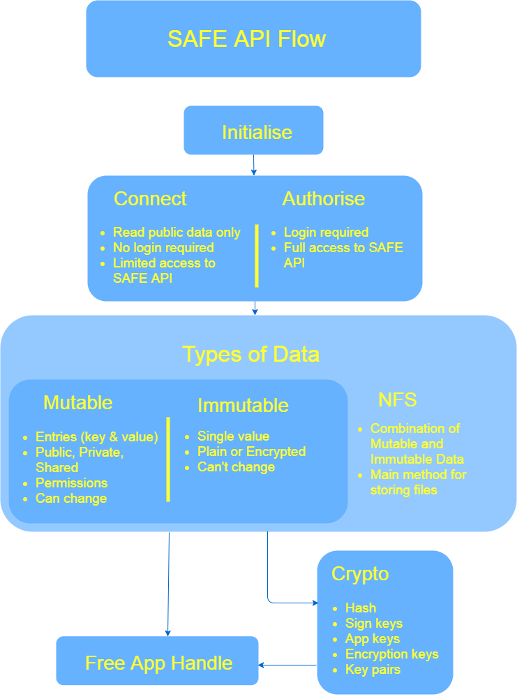

# SAFE API Overview

Development Guides by MaidSafe:

* [SAFE Network API - Getting started ](https://forum.safedev.org/t/safe-network-api-getting-started-draft/726/1)
* [How to develop for the SAFE Network ](https://forum.safedev.org/t/how-to-develop-for-the-safe-network-draft/843)

SAFE API Documentation

* [Node.js docs ](http://docs.maidsafe.net/safe_app_nodejs)
* [JavaScript docs ](http://docs.maidsafe.net/beaker-plugin-safe-app/)

Documentation and explanations of the SAFE Network by the community:

* [The SAFE Network Primer]
* [SAFE Network Architecture ](https://safe-network-explained.github.io/architecture)
* [The Documentation Topic ](https://safenetforum.org/t/the-documentation-topic/16149)
* [Introduction to the SAFE Network ](https://medium.com/@luandro/introduction-to-the-safe-network-33d8641b2dee)
* [Developing for the SAFE Browser ](https://medium.com/@luandro/developing-for-the-safe-browser-212decd575a3)

## SAFE Browser and the Authenticator

The SAFE Browser is developed by MaidSafe and provides access to the SAFE Network and websites on the SAFE Network.

It has an integrated feature called Authenticator. The Authenticator is used to for signing in and creating an account
on the SAFE Network.

### SAFE Accounts

An account on the SAFE Network is needed for uploading data. The current Test Network has restrictions on how much data
you can `PUT` on the Network. It measures your use in `PUTS`. Each action preformed on the Network other than `READ`
costs `PUTS`. Each account is limited to 1000 `PUTS`. This will change when SAFE Coin is implemented.

## SAFE API Flow

### Handles and the SAFE API

TODO: Needs to be verified

The SAFE API uses handles frequently. A handle is a reference to a resource. An example of a resource can be an
authentication token (App Handle) or the location of a Mutable Data Structure (Mutable Data Handle). These handles are
different for each session.

It is recommended to free handles when they are no longer needed or in use.

### Initialise

TODO: Needs to be verified

The first step to interact with the SAFE Network is to initialise your application. You need to pass information about
your application to the API, including App ID, Name and Vendor.

### Connect and Authorise

TODO: Needs to be verified

There are two network states in the SAFE API: Connected and Authorised.

The user doesn't need to be signed in to connect. When you are connected you can `READ`, this means you can only read
Public data and aren't able to preform actions such as: uploading to a Immutable or Mutable Data Structure, modifying
entries, inserting permissions or getting Keys.

The user needs to be signed to authorise. To authorise you need to specify which containers and permissions your app
wants to access and whether you would like to use your own App Container. When you are authorised you have full access
to the SAFE API and are able to preform all actions.

## Data on the SAFE Network

There are only two generic types of data on the SAFE Network, Mutable Data (can change) and Immutable Data (can't
change).

## Mutable Data

TODO: Needs to be verified

The Mutable Data on the SAFE Network is saved as a key-value store. This means requested data from the network will
return something like this `key 1: value 1`. This is called an entry. A Mutable Data Structure is composed of these
entries.

A Mutable Data Structure can hold up to a 1000 entries and contain a maximum of 1 MB of data.

To create and retrieve a Mutable Data Structure handle you will need to pass three parameters to it: your app handle, an
input such as an array or string and its type tag.

There are two types of Mutable Data Structures: Public (websites) and Private (private files).

Mutable Data Structures support: inserting, mutating and setting permissions.

### Type Tags

A type tag is a number that is used to differentiate between the different levels of the Mutable Data Structures. This
means that two of the same hashes can reference different Mutable Data Structures if they use different type tags.
Please note the type tags 0-10,000 are reserved by MaidSafe.

RFC: [Reserved Names](https://github.com/maidsafe/rfcs/blob/master/text/0003-reserved-names/0003-reserved-names.md)

### Shared Mutable Data

TODO: Need to explain better and verify  TODO: This is probably wrong

When you set up a Private or Public Mutable Data Structure it gives permissions to an application key. That key is
derived from the account and the application used to set up the Mutable Data Structure.

This means only that application in combination with the account has permissions for that Mutable Data Structure.

To enable permissions from a different application Shared Mutable Data is used to request permissions.

 SAFE Dev Topic:
[Shared Mutable Data Reference](https://forum.safedev.org/t/safe-network-api-getting-started-draft/726)   SAFE Dev
Topic:
[Shared Mutable Data Discussion](https://forum.safedev.org/t/need-help-with-shared-md-authorisesharemd-function/989)
 Video: [Shared Mutable Data by Hunter Lester](https://youtu.be/E80IH8mCKaw)

### Permissions

TODO: Needs to be verified

Mutable Data Structures can have permissions set to them. This means you can enable or disable permissions for yourself, another user or for everyone. These permissions include `Read`, `Delete`, `Insert`, `Update` and `ManagePermissions`.

`Read`: Access to view the Mutable Data Structure
 
`Delete`: Remove the value for a specific entry from the Mutable Data Structure
 
`Insert`: Inserting a new entry to the Mutable Data Structure
 
`Update`: Change the value for a specific entry from the Mutable Data Structure
 
`ManagePermissions`: Ability to specify permissions to the Mutable Data Structure

## Immutable Data

TODO: Needs to be verified

Immutable Data holds a single value. Its size is only limited by the current Test Network/Alpha 2 restrictions or when
the network is fully released the amount of SAFE Coin you have.

Immutable Data can be stored as: asymmetric encryption (Two people, email) symmetric encryption (one person, private
files), and plaintext (websites).

Immutable Data is retrieved with a Data Map Address. A Data Map Address is the 32 length hash of a particular Immutable
Data file content.

Since the Immutable Data's address is also a hash of its file content the file cannot be changed in any way and must
remain static unlike Mutable Data.

### Cipher Opt

TODO: Needs to be verified

Immutable Data can be saved using Symmetric or Asymmetric encryption or Plain Text.

| Symmetric                                                             | Asymmetric                                                            |                                Plain Text                                |
| --------------------------------------------------------------------- | --------------------------------------------------------------------- | :----------------------------------------------------------------------: |
| Only for user who made the data and uses only a single encryption key | Can be used for more than one person and uses a secret and public key | This data is in plain form for all who know the Immutable Data's Address |

<!-- This is done by using XOR. -->

<!-- #### Exclusive Or (XOR)

//Needs to be explained better, why it's used, how it works and verified to be make sure it's right // This is a good reference <https://blog.maidsafe.net/2016/05/27/structuring-networks-with-xor/> for XOR on vaults and clients.

I'll like to think of XOR (⊕) as the numbers canceling each other out. 0 is nothing so 0 canceling 0 is also nothing. 1 against 0, 0 is still nothing so 1 wins. 1 and 1 equal each other, therefore when they cancel each other out you are left with nothing, 0.

| A | B | C |
| - | - | - |
| 0 | 0 | 0 |
| 0 | 1 | 1 |
| 1 | 0 | 1 |
| 1 | 1 | 0 |

##### A ⊕ B (The XOR distance of A and B) == C

// Need To Detail : location, Commutative(A ⊕ B == B ⊕ A == C), unique identity with 2 closest nodes, ability to reverse equation(A ⊕ C == B),distributed hash tables, collision, differences between Mutable Data, Immutable Data and Vaults. -->

## Network File Storage (NFS)

TODO: Needs to be verified

It is possible to save data using a combination of Mutable and Immutable Data to create an emulation file-system on top
of the network called NFS.

NFS uses Immutable Data to save a file content, it then creates an entry in a given Mutable Data Structure. It uses the
file name as the entry's key and the Immutable Data's address as the entry's value.

This enables you to update or change a file by uploading a new Immutable Data file and then updating the file's address
in the entry's value. This Mutable Data Structure can be used again to store more NFS files.

### Hierarchy File-System Emulation

When dealing with folders and files being uploaded that are within subdirectories it is recommended to use a slash (/)
to separate the subdirectory and the file name.

This means the key of a Mutable Data Structure containing files would look something like this:
`filepath/subdir/index.html`.

## Containers

Containers are Mutable Data Structures that are generally used for storing particular types of data i.e. `_music` stores
music and sound files.

[More info about containers here](https://github.com/maidsafe/rfcs/blob/master/text/0046-new-auth-flow/containers.md)

### Root Container

TODO: Could be made simpler

The root container is the main entry point for the user and apps to interact with. It is a locally encrypted container
stored at a random location on the network known only to the user, that generally only the authenticator has write
access to.

Its reference will be stored in the users session packet on account creation. Keys starting with an underscore ( \_ )
are reserved for internal usage by the authenticator, while the authenticator may also allow the creation of other keys
later.

The authenticator has another mapped data container which holds the encryption keys per each container, which is locally
encrypted with a separate key that only the authenticator has access to and will never be shared. This is called:
`RootKeysContainer`.

#### Session Packet

TODO

### Default containers

The authenticator will create the following default containers within the root container when you create an account:

* `_apps/net.maidsafe.authenticator/`
* `_documents`
* `_downloads`
* `_music`
* `_pictures`
* `_videos`
* `_public`
* `_publicNames`

All data stored in these containers are stored randomly on the Network should be encrypted other than `_public`.

### App container

The app container is created for websites if they request their to have own container with their ID being used to
identify it. This means the app container name looks like `apps/id.example.net`.

## Cryptography

TODO: Still in progress
 TODO: Needs to be verified
 TODO: Use cases and examples
 [Sodium crypto library docs](https://download.libsodium.org/doc/)

### Hash

This is a 32 length string which is derived from an input of data such as a file or a string. This is not unique to the
user i.e. if I hash 'hello world' and you hash 'hello world' we will both get the same value back.

### Nonce

This is a random number that is generated for once off purposes. It is used in creating Private Mutable Data Structures.

### Comparisons between different cryptographic components

| Sign Key                                       |         Encryption keys          |
| ---------------------------------------------- | :------------------------------: |
| Used to verify data coming from a known sender | Used to encrypt and decrypt data |

TODO: Not sure yet what to used for single key

| Key Pairs                                                               |                                          Single Key                                           |
| ----------------------------------------------------------------------- | :-------------------------------------------------------------------------------------------: |
| Used to derive both the secret and public key for asymmetric encryption | Is either a secret or a public key \ Same key used to encrypt and decrypt data i.e. symmetric |

| Public                                         |                           Secret                           |
| ---------------------------------------------- | :--------------------------------------------------------: |
| A key made public that is used to encrypt data | A key that must be kept secret and is used to decrypt data |

| Get App                                              | Generate                          |                From Raw                 |
| ---------------------------------------------------- | --------------------------------- | :-------------------------------------: |
| Generates the key from the user and application data | Generates a new key pair randomly | Generates a new key from a given string |

| Encrypted                                        |                                                 Encrypted Sealed                                                 |
| ------------------------------------------------ | :--------------------------------------------------------------------------------------------------------------: |
| Data just encrypted with a public encryption key | This data is encrypted with a public encryption key and then encrypted again with a given string called a cipher |

## Domain Name System (DNS)

TODO: Explain thoroughly

DNS is the method websites are located on the SAFE Network using SAFE URLs. A SAFE URL consists of a URL that looks like
this: `safe://servicename.publicid`.

It works by using Mutable Data to locate stored NFS files. The Web Hosting Manager and SAFE Browser Overviews below go
into more detail of how DNS works.

## Mechanics of SAFE Applications

### How do MaidSafe's Applications work?

#### Web Hosting Manager

TODO: Needs to be verified

The Web Hosting Manager will first create a Public ID. This is a Public Mutable Data Structure with the Hash of the
Public ID you give it and the type tag of 15001, this Public ID can be used again in other websites and applications
such as the SAFE Email App.

You will then be asked to create a Web Service Name. Once you enter in a name a new random Public Mutable Data Structure
with a type tag of 15002 will be created, this will be used to store all our NFS files for this website and its randomly
generated name will be saved.

Then a new entry will be created and saved to our Public ID's Mutable Data Structure with the Web Service Name as its
key and the Random Mutable Data name as its value.

Once you upload an index.html to your web service you will be then able to navigate to your own website with its SAFE
URL.

#### SAFE Browser

TODO: Needs to be verified

The SAFE Browser works by getting the URL you pass to it and looking at the Public ID (the string after the dot). It
then hashes it and uses that hash as the Mutable Data Name and along with the type tag 15001 it can retrieve the Mutable
Data Structure.

Now the Browser looks at the Service Name in the URL, it will find a key that equals the Service Name in the Public ID's
Mutable Data Structure, that key's value will be a Mutable Data Name. The browser using that Mutable Data Name and the
type tag of 15002 will then get a Mutable Data Structure containing our website and all our files.

The browser will look for a specific key in this Mutable Data Structure, index.html. If the index.html key is found it
will retrieve it using NFS and display in the browser, otherwise if index.html isn't found the browser will return an
error.

#### SAFE Email App

### How do my websites work?

#### Demoy

Demoy was designed to showcase the Mutable Data functions. It works by using its app container to store and retrieve
files.

It does this by uploading a file with the filename as an entry's key and file content as its value (this means there is
1MB limit on all files uploaded). The file content must first be converted from a blob to an array that the SAFE API can
read.

When a file is selected to be retrieved the file extension is checked to see what format to display the file in. It
accepts video, image, audio and text, if the file isn't in an accepted it format the user will be presented with a
button to download the file. If the file is shown as a text file the user will be able to edit it in the browser and
save it directly to the network. There is also the ability to delete and update files in the browser.

Video: [Demoy Overview](https://www.youtube.com/watch?v=4yIRrn2e-9E)   Video:
[JavaScript File Rundown](https://www.youtube.com/watch?v=IySa5RB9iCE)   Github:
[Demoy](https://github.com/josephm1/Demoy)

#### Chaty

#### Vidy

#### Listy
