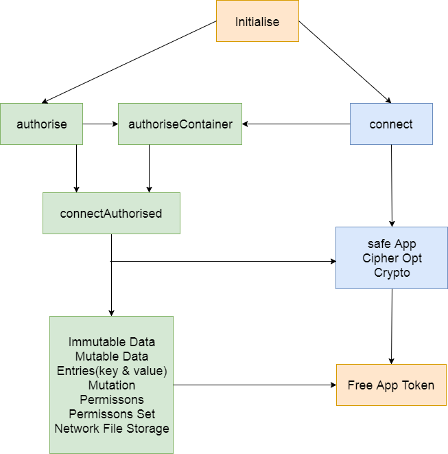

# A rundown of the SAFE API

// This needs to be edited, authorised is needed for some parts of these functions but not entire functions and authorised is needed for parts of safe App and Cipher Opt, so this is wrong. I think a flow chat like this is a good idea, so will use as a template, feel free to change it to a more accurate version with the xml file provided in the github.

// ignore




State  | Not Initialised   | Connected to Network  |   Authorised to use
--|---|---|--
**Colour**  |Orange   | Blue   |  Green

ignore //

There are only two generic types of data on the safe network, Mutable Data (can change) and Immutable Data (can't change).  

#### Mutable Data
// Needs to be verified

Mutable Data is subject to some limits, it cannot hold more than a 100 entries and the Mutable Data Structure itself must remain under 1 MB in size. Mutable Data has some abilities in particular the ability to set permissions, this means you can enable the ability to insert, update or delete entries in the Mutable Data structure for yourself, a particular person or everyone. To create and retrieve a Mutable Data structure handle you will need to pass three parameters to it your app handle, a 32 length buffer (this can be a hash of a particular string with safeCrypto.sha3Hash function) and its type tag. The Mutable Data on the safe network is saved as a key-value store. This means requested data from the network will return something like this `key 1: value 1`. This is called an entry.


#### Immutable Data
// Needs to be verified

Immutable Data can only hold one value, but its size is limited only by the current Testnet restrictions or when the network is fully released the amount of SAFECoin you have. Immutable Data has the ability to be encrypted with both asymmetric and symmetric encryption. Immutable Data is retrieved with a Data Map Address. A Data Map Address is the 32 length secure hash of a particular Immutable Data file content. The Data Map Address of a file can't change and is the same for everyone.This done by using XOR.

##### Exclusive Or (XOR)
//Needs to be explained better, why it's used, how it works and verified to be make sure it's right
// This is a good reference https://blog.maidsafe.net/2016/05/27/structuring-networks-with-xor/ for XOR on vaults and clients.

I'll like to think of XOR (⊕) as the numbers canceling each other out. 0 is nothing so 0 canceling 0 is also nothing. 1 against 0, 0 is still nothing so 1 wins. 1 and 1 equal each other, therefore when they cancel each other out you are left with nothing, 0.

A  | B  |C |   
--|---|---
0  | 0 | 0
0  | 1 | 1
1  | 0 | 1
1  | 1 | 0

######A ⊕ B (The **XOR** distance of A and B) == C

// Need To Detail : location, Commutative(A ⊕ B == B ⊕ A == C), unique identity with 2 closest nodes, ability to reverse equation(A ⊕ C == B),distributed hash tables, collision, differences between Mutable Data, Immutable Data and Vaults.

#### Network File Storage
// Needs to be verified

It is possible to combine the advantages of the these two data types into an emulation file system on top of the network called NFS (Network File Storage). A file will be uploaded to the SAFE
Network using Immutable Data with its value being the file content. Then a new Mutable Data entry is created with the file name being its key and the Data Map Address of the Immutable Data file as its value. Since we are using Mutable Data to reference the file we are able to update the file by creating another Immutable Data entry and using its Data Map Address as the new value in our Mutable Data Structure. This Mutable Data Structure can be used again to store more NFS files.

### We will now take a look at some MaidSafe Applications.

#### Web Hosting Manager
// Needs to be verified

The Web Hosting Manager will first create a Public ID. This is a Public Mutable Data Structure with the Hash of the string you give it and the type tag of 15001, this Public ID can be used again in other websites and applications such as the SAFE Email App. Then you will be asked to create a Web Service Name. Once you enter in a name a new random (this buffer is created randomly so you don't pass any strings to it) Public Mutable Data Structure with a type tag of 15002 will be created, this will be used for all our NFS files for this website and its Random Mutable Data Name will be saved. Then a new entry will be created and saved to our Public ID's Mutable Data Structure with the Web Service Name as its key and the Random Mutable Data name as its value. Once you upload an index.html to your web service you will be then able to navigate to your own website, it will have a URL which looks something like this:
```
safe://servicename.publicid
```
#### SAFE Browser
// Needs to be verified


The SAFE Browser works by getting the URL you pass to it and looking at the Public ID (the string after the dot). It then hashes it and uses that hash as the 32 length buffer along with the type tag 15001 so it can retrieve the Mutable Data Structure. Now the Browser looks at the Service Name in the URL, it will find a key that equals are Service Name in the Public ID's Mutable Data Structure, that key's value will be 32 length buffer. The browser will then get a Mutable Data Structure using that buffer and the type tag of 15002, this will return the Mutable Data Structure containing our website and all our files. The browser will look for a specific key in this Mutable Data Structure, index.html. If the index.html key is found it will retrieve it using NFS and display in the browser, otherwise if index.html isn't found the browser will return an error.

### We will now take a look at some websites I have developed.

#### Demoy
#### Chaty
#### Vidy
#### Listy
